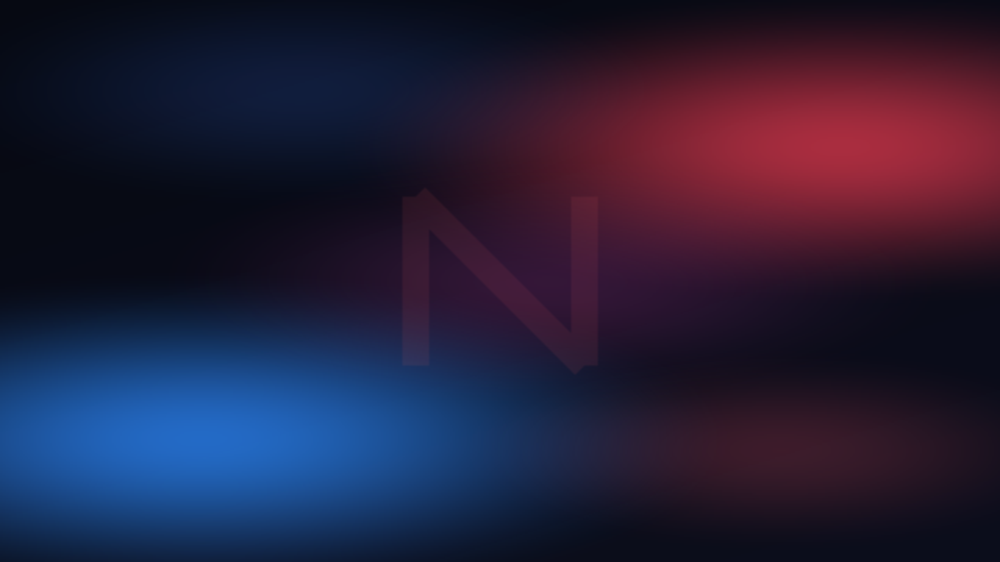
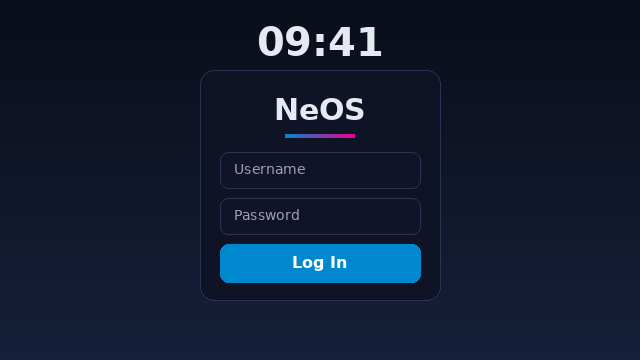

<p align="center">
  
</p>

<h1 align="center">NeOS (Next Evolution Operating System)</h1>

<p align="center">
  <a href="https://github.com/uthsarad/NeOS/actions/workflows/build-iso.yml"></a>
  <a href="https://github.com/uthsarad/NeOS/releases"></a>
  
  
  
</p>

**NeOS** is a curated, snapshot-based Arch Linux desktop distribution engineered for predictable behavior, system stability, and a refined **KDE Plasma 6** experience. Designed for users transitioning from Windows, NeOS bridges the gap between the flexibility of a rolling release and the reliability of a validated workstation environment.

It ships as a full **live installer** — boot into a working desktop, try it, then install with the Calamares wizard, the same model as a mainstream desktop OS. Hold the firmware menu for Copy-to-RAM or Safe Graphics; attach a `cidata` volume for an Omarchy-style unattended install.

> **Installing without a network:** an ISO built locally with `sudo ./build.sh` embeds an offline package repository, so the installer completes with no internet connection. CI passes `--no-offline-repo` to the same script, so the ISOs published to Releases install from the network.

---

## Visual Overview

| Desktop Environment & Wallpaper | Calamares Live Installer |
| :---: | :---: |
|  |  |

| SDDM Login Display Manager |
| :---: |
|  |

---

## Core Objectives

*   **Snapshot-Gated Stability**: Coherent package sets are validated and promoted via Btrfs snapshots to minimize breakage.
*   **Refined User Experience**: A polished KDE Plasma 6 environment pre-configured with Windows-familiar defaults, branded boot splash, and wallpaper.
*   **Automated Hardware Optimization**: Integrated driver management for NVIDIA, AMD, and Intel hardware with DKMS support, Intel thermal management, software-rendering fallback so the desktop comes up even inside VMs without 3D acceleration, and modern wireless/modem support.
*   **Secure by Default**: Hardened kernel parameters, pre-configured UFW, systemd service sandboxing, and user-initiated Secure Boot helpers (sbctl, mokutil, efitools).
*   **Efficient Footprint**: Optimized build profile with a compact zstd-compressed live image (no size cap; releases ship via SourceForge).

---

## Repository Ecosystem

NeOS leverages and extends several key projects within the Arch Linux ecosystem:

| Project / Contributor | Role |
| :--- | :--- |
| **[ALCI](https://github.com/arch-linux-calamares-installer)** | Base installer framework and Calamares integration. |
| **[Chaotic-AUR](https://github.com/chaotic-aur)** | High-performance kernels (Zen) and pre-compiled packages. |
| **[NeoCortex](https://github.com/uthsarad/NeoCortex)** | Local-first, capability-gated sovereign AI intelligence layer. |
| **[Uthsara](https://github.com/uthsarad)** | Creator & Lead Systems Architect. |
| **[Nimuthu Ganegoda](https://github.com/NimuthuGanegoda)** | Core Contributor & Systems Engineer. |
| **[Miko Yae](https://github.com/MikoYae-AI)** | Core Collaborator, Autonomous Tooling & Systems Engineering. |
| **[Sovereign Core](https://github.com/NimuthuGanegoda/Sanctuary-of-Eternity)** | Architectural guidance and security policy foundations. |
| **[NeOS Team](https://github.com/uthsarad/NeOS/graphs/contributors)** | Collaborative Development & Architectural Review. |

---

## Tooling Stack

NeOS uses a focused tooling ecosystem for build automation, validation, and developer productivity:

| Language | Component | Role |
| :--- | :--- | :--- |
| **Rust** | [`tools/neos-profile-audit/`](tools/neos-profile-audit/) | Type-safe profile hygiene and package invariant validator — the single source of truth for profile auditing. |
| **Go** | [`tools/neosctl/`](tools/neosctl/) | High-speed CLI for concurrent mirror benchmarking. |
| **C# (.NET 8)** | [`tools/NeosDiagnostics/`](tools/NeosDiagnostics/) | Enterprise compliance inspector for kernel sysctl and Btrfs security rules. |
| **Ruby** | [`tools/neos_tasks.rb`](tools/neos_tasks.rb) / [`Rakefile`](Rakefile) | Task runner for manifest generation and CI pipeline orchestration. |
| **Python** | [`tools/gen-bootlogo-frames.py`](tools/gen-bootlogo-frames.py) | Asset pipeline and visual branding frame synthesis. |
| **Shell / Bash** | [`build.sh`](build.sh) & `profile/airootfs/` | Low-level POSIX runtime hooks, installer execution, and system initialization. |

---

## Testing & Quality Assurance

Because NeOS is a curated distribution, every release is exercised before it reaches users. QA is led by **Hajime**, covering:

*   **Boot validation** — the ISO is booted (BIOS and UEFI) to confirm it reaches the live desktop, including in virtual machines (VMware, VirtualBox, QEMU/KVM). Copy-to-RAM, Safe Graphics and Verbose entries are first-class boot options; `neos-doctor` reports whether `graphical.target` actually came up.
*   **Installer validation** — the Calamares flow is run end-to-end so installs complete and reboot into a working system.
*   **Automated build gates (CI)** — every push to `testing` runs ShellCheck, Trivy, the 40-odd `tests/verify_*.sh` gates with `REQUIRE_TOOLS=1` (the Ruby, Go, .NET and Rust toolchains are installed, so a gate can no longer quietly degrade into a grep), and a chroot verification that the installer's libraries resolve.
*   **Boot verification** — the built ISO is booted in QEMU (BIOS and UEFI) and the build fails unless the guest reports an active `graphical.target` and renders a non-blank frame; a timeout is not a pass.

> CI boots the live desktop and asserts it rendered, but it cannot click through an interactive install, so hardware/VM install testing by the QA team remains the final gate before a release is trusted.

---

## Documentation

Comprehensive documentation is available in the `docs/` directory:

*   **[Documentation index](docs/README.md)** — Everything in `docs/`, indexed.
*   **[Deployment Handbook](docs/user-guide/HANDBOOK.md)** — Installation and initial setup.
*   **[System Architecture](docs/architecture/ARCHITECTURE.md)** — In-depth look at the NeOS stability model.
*   **[Development Roadmap](docs/architecture/ROADMAP.md)** — Feature milestones and release phases.
*   **[Hardware Support](docs/user-guide/VM_STARTUP.md)** — Driver management and virtualization notes.
*   **[Troubleshooting](docs/user-guide/TROUBLESHOOTING.md)** — Recovery and common issue resolution.

---

## Quick Start

1.  **Download the ISO:** Head to the **[Releases](https://github.com/uthsarad/NeOS/releases)** section and download the latest `neos-*-x86_64.iso`.
2.  **Flash to USB:** Use Ventoy, Rufus, or BalenaEtcher.
3.  **Boot & Try:** Boot the USB to explore the live KDE Plasma desktop.
4.  **Install:** Launch **Install NeOS** and follow the curated Calamares installation wizard.

*Note: The ISO is automatically built in the cloud upon every push to the `testing` branch, which is the branch releases are currently cut from. `main` is intentionally idle until the official public release.*

---

## Local Build Instructions

To generate a NeOS ISO locally, ensure `archiso` is installed and execute the build script from the repository root:

```bash
sudo ./build.sh                 # full build, including the offline install repo
sudo ./build.sh --no-offline-repo   # smaller/faster; the ISO then installs from the network
sudo ./build.sh --ci            # non-interactive (never prompts about a stale work/)
```

`build.sh` is the single build entrypoint: CI runs the same script (with
`--ci --no-offline-repo`), so the image you build locally is produced by the same
code path as the published one.

---

## Contributing

We welcome technical contributions that align with our stability-first philosophy. Please consult the **[Contribution Guidelines](CONTRIBUTING.md)** before submitting pull requests, and review our **[Code of Conduct](CODE_OF_CONDUCT.md)**.

---

## Architecture Support Matrix

NeOS officially supports the `x86_64` architecture only.

*   **`x86_64`**: Full feature parity, GUI installer support, snapshot-gated stability, and ZRAM optimization.

<!-- SENTINEL: Validate that no external URLs are introduced here. -->

---

**Developed by the NeOS Team | 2026**
