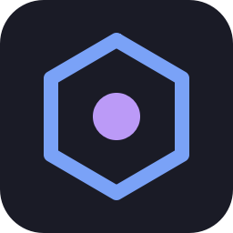
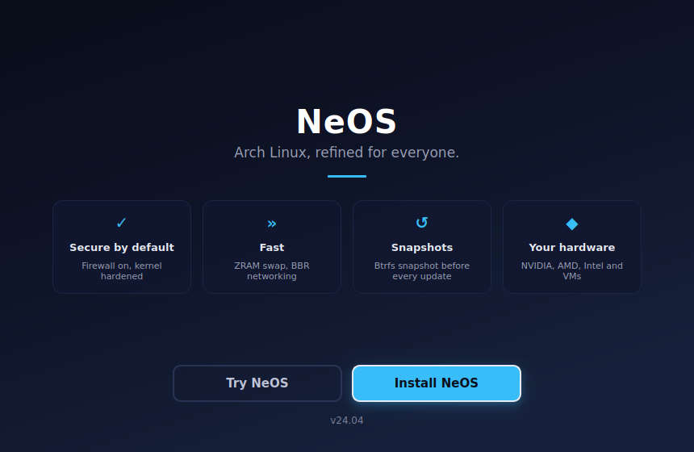
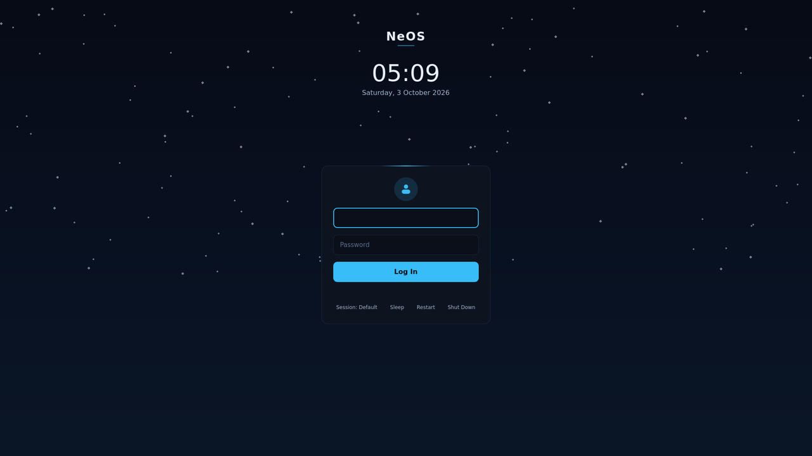
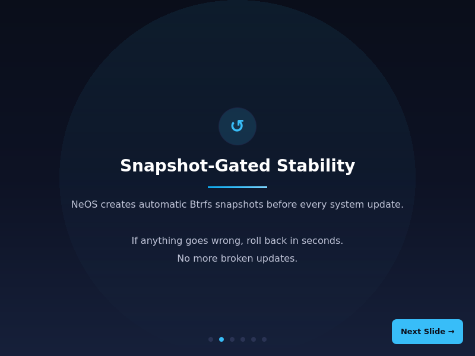

<<<<<<< HEAD
<p align="center">
  
</p>

<h1 align="center">NeOS</h1>

<p align="center"><strong>Arch power, without the chaos.</strong><br>
A curated, snapshot-based desktop distribution built on Arch Linux, with KDE Plasma 6,
rollback-protected updates and a desktop that feels familiar from day one.</p>

<p align="center">
  <a href="https://github.com/uthsarad/NeOS/actions/workflows/build-iso.yml"></a>
  <a href="https://github.com/uthsarad/NeOS/releases"></a>
  
  
  <a href="LICENSE"></a>
</p>

<p align="center">
  <a href="https://neosweb.netlify.app">Website</a> ·
  <a href="https://github.com/uthsarad/NeOS/releases">Download</a> ·
  <a href="docs/user-guide/HANDBOOK.md">Handbook</a> ·
  <a href="docs/user-guide/TROUBLESHOOTING.md">Troubleshooting</a> ·
  <a href="https://github.com/uthsarad/NeOS/issues">Report a problem</a>
</p>

> **NeOS is in beta.** Every 2026 build is a pre-release for testing. Try it in a
> virtual machine or on a spare disk first, and keep backups of anything you care about.

---

## What NeOS is

Arch Linux is fast, current and flexible, but it expects you to assemble and maintain
the system yourself. NeOS keeps plain Arch underneath and adds the parts Arch
deliberately leaves out:

- **A finished KDE Plasma 6 desktop.** Start menu, taskbar and system tray where
  someone coming from Windows expects them, with Firefox, LibreOffice, VLC, Discover
  and Flatpak ready to use. Plasma runs on Wayland on Intel, AMD and NVIDIA
  graphics; virtual machines, Safe Graphics and other display drivers fall back to
  X11 automatically so the desktop always comes up
  ([choosing a session](docs/user-guide/TROUBLESHOOTING.md#choosing-wayland-or-x11)).
- **Updates you can undo.** The root filesystem is Btrfs. Snapper takes a snapshot
  before and after every package transaction, and each snapshot appears in the GRUB
  menu, so a system that no longer reaches the desktop can be booted from its last
  good state and rolled back.
- **Hands-off maintenance.** `neos-autoupdate` checks for updates every day, refuses
  to run without snapshot protection or enough free disk space, and tells you on the
  desktop when an update succeeded or failed.
- **Hardware that works on first boot.** Firmware, the open NVIDIA driver (installed
  systems), Intel thermal management, printing, scanning, Bluetooth and mobile
  broadband are included. Inside a VM without 3D acceleration, the desktop falls back
  to software rendering instead of a black screen.
- **Secure defaults.** UFW firewall enabled, hardened kernel parameters, a tightened
  SSH configuration (no root login) and sandboxed NeOS services. Secure Boot signing
  tools (`sbctl`, `mokutil`) are included for users who want to enroll their own keys.
- **Still your computer.** No account and no telemetry: crash reports are sent only
  if you opt in and confirm each one. Everything is standard Arch packages and
  configuration, so you can change anything.

It runs well on the many 64-bit machines that Windows 11 no longer supports: 4 GB of
RAM is the floor and 8 GB is comfortable.

## Screenshots

| Welcome (live session) | Login screen |
| :---: | :---: |
|  |  |

| Installer | Default wallpaper |
| :---: | :---: |
|  |  |

<sub>Rendered from the current sources by the tools in [`tools/`](tools/) (see
[Visual identity](docs/architecture/BRAND_STRUCTURE.md#visual-identity)).</sub>

## Install

**Requirements:** a 64-bit (x86_64) PC, 4 GB RAM (8 GB recommended), 20 GB of free
disk (SSD recommended; snapshots need room) and a USB stick of 8 GB or more.

1. **Download** the latest ISO from [Releases](https://github.com/uthsarad/NeOS/releases)
   (direct download or BitTorrent). Each release also carries `SHA256SUMS`,
   `SHA512SUMS` and VirtualBox/VMware appliance templates.
2. **Verify** the download: `sha256sum -c SHA256SUMS --ignore-missing`.
3. **Write** the ISO to a USB stick with Ventoy, Rufus or balenaEtcher. In a VM,
   attach the ISO instead ([VM guide](docs/user-guide/VM_STARTUP.md)).
4. **Boot** the stick with Secure Boot disabled. You land in a live KDE Plasma
   desktop; try it, then choose **Install NeOS**.
5. **Install** with the Calamares wizard: location, keyboard, disk and user, then
   reboot. A typical install takes 20 to 30 minutes.

The published ISOs install their packages from the network, so keep the machine
online during installation. An ISO you build yourself with `sudo ./build.sh` embeds an
offline package repository and installs without a connection.

The boot menu also offers **Copy to RAM**, **Safe Graphics** (for GPUs that show a
black screen) and **Screen Reader**, which starts with speech on: espeakup on the
text consoles and the Orca screen reader on the desktop and in the installer. A
system installed from that entry keeps the screen reader on.
Unattended installs are covered in [Assisted install](docs/user-guide/AUTOINSTALL.md).

## After installing

| Tool | What it does |
| :--- | :--- |
| **NeOS Operations Hub** | Menu entry for system updates, snapshot browsing and rollback, crash-reporting settings and bug reports. |
| `neos-autoupdate` | Daily snapshot-protected system update (`neos-autoupdate.timer`). |
| `snapper -c root list` | Lists the rollback points; see [Troubleshooting](docs/user-guide/TROUBLESHOOTING.md) for restoring one. |
| `neos-doctor` | Health report: graphical target, login manager, network, failed services, memory and disk. Attach its output (`--json`) to bug reports. |
| `neos-driver-manager` | Detects GPU, network and CPU hardware and reports the driver in use or the package to install. |
| `neos-display-sync` | On X11 sessions, keeps touchscreen and tablet input aligned with screen rotation and applies display scaling. (On Wayland, KWin does this itself.) |

## Documentation

- [Documentation index](docs/README.md): everything in `docs/`
- [Handbook](docs/user-guide/HANDBOOK.md): installation and first setup
- [Running NeOS in a VM](docs/user-guide/VM_STARTUP.md)
- [Troubleshooting](docs/user-guide/TROUBLESHOOTING.md): recovery, rollback and common problems
- [Architecture](docs/architecture/ARCHITECTURE.md) and [Roadmap](docs/architecture/ROADMAP.md)

## Building the ISO

NeOS is an [archiso](https://wiki.archlinux.org/title/Archiso) profile. On an Arch
system with `archiso` installed, run from the repository root:

```bash
sudo ./build.sh                     # full build, including the offline install repo
sudo ./build.sh --no-offline-repo   # smaller and faster; installs from the network
sudo ./build.sh --ci                # non-interactive (never prompts about a stale work/)
```

`build.sh` is the only build entrypoint. CI runs the same script with
`--ci --no-offline-repo`, so a local build follows the same code path as a published
release. Run `./build.sh --help` for all options.

## How releases are tested

Every push to `testing` builds an ISO in GitHub Actions and runs:

- ShellCheck and a Trivy vulnerability scan;
- the `tests/verify_*.sh` gates (package lists, installer configuration, services,
  branding, security settings and more) with every toolchain installed, so no gate is
  silently skipped;
- a boot test of the finished ISO in QEMU under both BIOS and UEFI, which fails unless
  the live desktop actually starts and draws a non-blank screen.

CI cannot click through an interactive install, so installs on real hardware and in
virtual machines remain the final check before a build is recommended.

## Project layout

| Path | Contents |
| :--- | :--- |
| [`profile/`](profile/) | The archiso profile: package list, boot menus and the `airootfs/` overlay (installer, branding, NeOS tools). |
| [`build.sh`](build.sh) | Single build entrypoint for local and CI builds. |
| [`tests/`](tests/) | Repository gates (`verify_*.sh`); run all of them before opening a pull request. |
| [`tools/`](tools/) | Manifest generation, brand-asset rendering and helper tools: a profile auditor (Rust), mirror benchmark CLI (Go), security inspector (.NET) and task runner (Ruby). |
| [`docs/`](docs/) | User guides, architecture notes and decision records. |

## Built on

NeOS is assembled from the work of these projects:
[Arch Linux](https://archlinux.org) ·
[KDE Plasma](https://kde.org/plasma-desktop/) ·
[Calamares](https://calamares.io) (built by [Garuda Linux](https://garudalinux.org)) ·
[Snapper](http://snapper.io) ·
[grub-btrfs](https://github.com/Antynea/grub-btrfs) ·
[Chaotic-AUR](https://aur.chaotic.cx)

## Contributing

Bug reports and pull requests are welcome. Please read the
[contribution guidelines](CONTRIBUTING.md) and the [code of conduct](CODE_OF_CONDUCT.md)
first, and report security issues privately as described in [SECURITY.md](SECURITY.md).

NeOS is created by [Uthsara](https://github.com/uthsarad) with
[Nimuthu Ganegoda](https://github.com/NimuthuGanegoda) and
[contributors](https://github.com/uthsarad/NeOS/graphs/contributors).

## License

[MIT](LICENSE). Bundled packages remain under their own upstream licenses.
=======
# NeOS (Next Evolution Operating System)

[](https://github.com/uthsarad/NeOS/actions/workflows/build-iso.yml)
[](https://github.com/uthsarad/NeOS/releases)


**NeOS** is a curated, snapshot-based Arch Linux desktop distribution engineered for predictable behavior, system stability, and a refined **KDE Plasma 6** experience. Designed for users transitioning from Windows, NeOS bridges the gap between the flexibility of a rolling release and the reliability of a validated workstation environment.

It ships as a full **live installer** — boot into a working desktop, try it, then install offline with the Calamares wizard, the same model as a mainstream desktop OS.

---

## Core Objectives

*   **Snapshot-Gated Stability**: Coherent package sets are validated and promoted via Btrfs snapshots to minimize breakage.
*   **Refined User Experience**: A polished KDE Plasma 6 environment pre-configured with Windows-familiar defaults, branded boot splash, and wallpaper.
*   **Automated Hardware Optimization**: Integrated driver management for NVIDIA, AMD, and Intel hardware with DKMS support, Intel thermal management, software-rendering fallback so the desktop comes up even inside VMs without 3D acceleration, and modern wireless/modem support.
*   **Secure by Default**: Hardened kernel parameters, pre-configured UFW, systemd service sandboxing, and user-initiated Secure Boot helpers (sbctl, mokutil, efitools).
*   **Efficient Footprint**: Optimized build profile maintaining a sub-2GB ISO size for rapid deployment.

---

## Repository Ecosystem

NeOS leverages and extends several key projects within the Arch Linux ecosystem:

| Project / Contributor | Role |
| :--- | :--- |
| **[ALCI](https://github.com/arch-linux-calamares-installer)** | Base installer framework and Calamares integration. |
| **[Chaotic-AUR](https://github.com/chaotic-aur)** | High-performance kernels (Zen) and pre-compiled packages. |
| **[NeoCortex](https://github.com/uthsarad/NeoCortex)** | Local-first, capability-gated sovereign AI intelligence layer. |
| **[Uthsara](https://github.com/uthsarad)** | Creator & Lead Systems Architect. |
| **[Nimuthu Ganegoda](https://github.com/NimuthuGanegoda)** | Core Contributor & Systems Engineer. |
| **[Miko Yae](https://github.com/MikoYae-AI)** | Core Collaborator, Autonomous Tooling & Systems Engineering. |
| **[Sovereign Core](https://github.com/NimuthuGanegoda/Sanctuary-of-Eternity)** | Architectural guidance and security policy foundations. |
| **[NeOS Team](https://github.com/uthsarad/NeOS/graphs/contributors)** | Collaborative Development & Architectural Review. |

---

## Tooling Stack

NeOS uses a focused tooling ecosystem for build automation, validation, and developer productivity:

| Language | Component | Role |
| :--- | :--- | :--- |
| **Rust** | [`tools/neos-profile-audit/`](tools/neos-profile-audit/) | Type-safe profile hygiene and package invariant validator — the single source of truth for profile auditing. |
| **Go** | [`tools/neosctl/`](tools/neosctl/) | High-speed CLI for concurrent mirror benchmarking. |
| **C# (.NET 8)** | [`tools/NeosDiagnostics/`](tools/NeosDiagnostics/) | Enterprise compliance inspector for kernel sysctl and Btrfs security rules. |
| **Ruby** | [`tools/neos_tasks.rb`](tools/neos_tasks.rb) / [`Rakefile`](Rakefile) | Task runner for manifest generation and CI pipeline orchestration. |
| **Python** | [`tools/gen-bootlogo-frames.py`](tools/gen-bootlogo-frames.py) | Asset pipeline and visual branding frame synthesis. |
| **Shell / Bash** | [`build.sh`](build.sh) & `profile/airootfs/` | Low-level POSIX runtime hooks, installer execution, and system initialization. |

---

## Testing & Quality Assurance

Because NeOS is a curated distribution, every release is exercised before it reaches users. QA is led by **Hajime**, covering:

*   **Boot validation** — the ISO is booted (BIOS and UEFI) to confirm it reaches the live desktop, including in virtual machines (VMware, VirtualBox, QEMU/KVM).
*   **Installer validation** — the Calamares flow is run end-to-end so installs complete and reboot into a working system.
*   **Automated build gates (CI)** — every push to `main` runs ShellCheck, Trivy, config checks, and a chroot verification that the installer's libraries resolve, so a broken installer fails the build instead of shipping.

> CI cannot boot a desktop or run an interactive install on its own, so hardware/VM smoke testing by the QA team is the final gate before a release is trusted.

---

## Documentation

Comprehensive documentation is available in the `docs/` directory:

*   **[Deployment Handbook](docs/user-guide/HANDBOOK.md)** — Installation and initial setup.
*   **[System Architecture](docs/architecture/ARCHITECTURE.md)** — In-depth look at the NeOS stability model.
*   **[Development Roadmap](docs/architecture/ROADMAP.md)** — Feature milestones and release phases.
*   **[Hardware Support](docs/user-guide/VM_STARTUP.md)** — Driver management and virtualization notes.
*   **[Troubleshooting](docs/user-guide/TROUBLESHOOTING.md)** — Recovery and common issue resolution.

---

## Quick Start

1.  **Download the ISO:** Head to the **[Releases](https://github.com/uthsarad/NeOS/releases)** section and download the latest `neos-*-x86_64.iso`.
2.  **Flash to USB:** Use Ventoy, Rufus, or BalenaEtcher.
3.  **Boot & Try:** Boot the USB to explore the live KDE Plasma desktop.
4.  **Install:** Launch **Install NeOS** and follow the curated Calamares installation wizard.

*Note: The ISO is automatically built in the cloud upon every push to the main branch.*

---

## Local Build Instructions

To generate a NeOS ISO locally, ensure `archiso` is installed and execute the build script from the repository root:

```bash
sudo ./build.sh
```

---

## Contributing

We welcome technical contributions that align with our stability-first philosophy. Please consult the **[Contribution Guidelines](CONTRIBUTING.md)** before submitting pull requests, and review our **[Code of Conduct](CODE_OF_CONDUCT.md)**.

---

## Architecture Support Matrix

NeOS officially targets the `x86_64` architecture. Other architectures are maintained on a best-effort, experimental basis.

*   **`x86_64` (Primary)**: Full feature parity, GUI installer support, snapshot-gated stability, and ZRAM optimization.
*   **`i686` (Experimental)**: Minimal CLI base only. Lacks GUI installer, snapshot integration, and ZRAM support.
*   **`aarch64` (Experimental)**: Minimal CLI base only. Lacks GUI installer, snapshot integration, and ZRAM support.

<!-- SENTINEL: Validate that no external URLs are introduced here. -->

---

**Developed by the NeOS Team | 2026**
>>>>>>> 5772ff2 (Redirect Jules PRs to testing branch and prevent merges to main)
