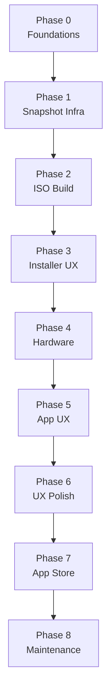

# NeOS Development Roadmap

[← Back to Documentation Index](../README.md#documentation)

## Table of Contents

- [Scope and Philosophy](#scope-and-philosophy)
- [Phase 0: Foundations and Policy](#phase-0-foundations-and-policy)
- [Phase 1: Repository Snapshot Infrastructure](#phase-1-repository-snapshot-infrastructure)
- [Phase 2: ISO Build and Branding](#phase-2-iso-build-and-branding)
- [Phase 3: Installer and First-Boot UX](#phase-3-installer-and-first-boot-ux)
- [Phase 4: Hardware & Driver Reliability](#phase-4-hardware--driver-reliability)
- [Phase 5: Application & Update UX](#phase-5-application--update-ux)
- [Phase 6: UX Polish and Windows Familiarity](#phase-6-ux-polish-and-windows-familiarity)
- [Phase 7: App Store and Package Management UX](#phase-7-app-store-and-package-management-ux)
- [Phase 8: Long-Term Maintenance and Distribution](#phase-8-long-term-maintenance-and-distribution)
- [Best-Practice Recommendations](#best-practice-recommendations-windows-familiarity--kde-idioms)
- [Risks and Pitfalls](#risks-and-pitfalls-arch-based-distribution)
- [Success Metrics](#success-metrics)

## Scope and Philosophy

NeOS is a curated rolling-release, Arch-based desktop OS targeting predictable behavior through staged updates and QA validation. The roadmap prioritizes a Windows-familiar KDE Plasma experience, low-friction onboarding, and sustainable long-term maintenance.

## Phase 0: Foundations and Policy

**Goals**

- Establish project standards, repository structure, and contributor documentation.
- Define build pipeline requirements, QA expectations, and release cadence.

**Key Deliverables**

- Packaging and repo policies (what lives in Arch vs NeOS repos).
- CI/CD plan for repo builds, ISO generation, and update promotion.
- Baseline KDE Plasma configuration and UX principles.

## Phase 1: Repository Snapshot Infrastructure

**Goals**

- Build the infrastructure that makes snapshot-based rolling releases reliable.

**Workstreams**

1. **Build system**
   - Use Arch ISO tooling (`archiso`) as the base.
   - Create a dedicated NeOS profile with custom packages and configs.
   - Automate ISO builds via CI for nightly and release candidates.
2. **Base image defaults**
   - Preconfigure KDE Plasma defaults (layout, theming, wallpapers).
   - Integrate Calamares with NeOS branding and default options.
   - Add default apps (Brave, VLC, nomacs, Thunderbird, LibreOffice).

**Acceptance Criteria**

- A documented and repeatable snapshot promotion process.
- Staging snapshots validated before stable release.

## Phase 2: ISO Build and Branding

**Goals**

- Define a reliable staging pipeline and update channel strategy.
- Keep KDE/Qt/drivers stable without freezing Arch updates.

**Workstreams**

1. **Repository topology**
   - Mirror Arch official repos for baseline packages.
   - Create NeOS-curated repos for KDE, Qt, drivers, firmware, and key desktop utilities.
   - Maintain a staging repo for pre-release validation.
2. **Update gates**
   - Automated smoke testing for KDE/Qt updates.
   - Manual QA for desktop-critical changes and driver bumps.
3. **Release process**
   - Staged rollout: _staging → stable_ using validated snapshots.
   - Keep rollback packages for critical components.

**Acceptance Criteria**

- ISO builds are reproducible across CI environments.
- Clean install reaches a ready-to-use desktop without manual fixes.

## Phase 3: Installer and First-Boot UX

**Goals**

- Deliver a Windows-like installation flow and a reliable first-boot experience.

**Workstreams**

1. **Calamares customization**
   - Streamline the installer with sensible defaults.
   - Provide Replace Windows / Dual Boot flows.
   - Optional advanced mode for partitioning and custom packages.
2. **First-boot wizard**
   - Offer post-install updates on first boot.
   - Run driver detection and firmware installation.
   - Provide privacy and telemetry opt-in controls.

**Acceptance Criteria**

- New users reach a functioning desktop with no terminal steps.
- Dual-boot setup works reliably on common hardware.

## Phase 4: Hardware & Driver Reliability

**Goals**

- Ensure hardware works out of the box, with NVIDIA treated as a first-class requirement.

**Workstreams**

1. **Driver automation**
   - Detect Nvidia GPUs and install proprietary drivers automatically.
   - Integrate dkms module handling for kernel updates.
2. **Firmware coverage**
   - Curate Wi-Fi and laptop firmware packages in NeOS repos.
3. **Hardware quirks**
   - Default power profiles and known-quirk presets for common laptops.

**Acceptance Criteria**

- Nvidia users boot to working graphics without manual intervention.
- Common laptops function without driver troubleshooting.

## Phase 5: Application & Update UX

**Goals**

- Make software management GUI-first and predictable.

**Workstreams**

1. **System hardening**
   - Adopt secure kernel/sysctl defaults where practical.
   - Provide optional `linux-lts` fallback for stability-sensitive hardware.
2. **App sandboxing**
   - Prefer Flatpak for GUI apps where appropriate.
   - Ensure KDE portals are correctly configured.
3. **Policy documentation**
   - Clear guidelines for app confinement and exceptions.

**Acceptance Criteria**

- Users can install and update apps without terminal usage.
- Update UX surfaces clear notes for desktop-critical changes.

## Phase 6: UX Polish and Windows Familiarity

**Goals**

- Deliver a KDE Plasma experience that feels familiar to Windows users.

**Workstreams**

1. **UI layout**
   - Ship a taskbar and launcher layout aligned with Windows expectations.
   - Adjust default shortcuts to reduce surprises.
2. **Theme and branding**
   - Consistent default theme, iconography, boot visuals, and welcome app.
3. **App defaults**
   - Set sensible default applications and file associations.

**Acceptance Criteria**

- Users can navigate without relearning desktop conventions.
- Visual consistency across core desktop surfaces.

## Phase 7: App Store and Package Management UX

**Goals**

- Ensure day-to-day software management does not require terminal usage.

**Workstreams**

1. **Discover integration**
   - Brand KDE Discover for NeOS and set it as the default app store.
   - Validate PackageKit/libalpm backend behavior for updates and installations.
2. **Optional advanced tooling**
   - If AUR access is desired, ship pamac as an opt-in advanced tool (not default).
3. **Update UX**
   - Surface clear update notes for desktop-critical changes.

**Acceptance Criteria**

- Users can install and update apps without terminal commands.
- Discover handles system updates reliably.

## Phase 8: Long-Term Maintenance and Distribution

**Goals**

- Sustain NeOS as a publicly distributed OS with predictable operations.

**Workstreams**

1. **Release operations**
   - Define stable and testing channels.
   - Document how updates are promoted from snapshots.
2. **Support and feedback**
   - Issue tracking and community support channels.
   - Optional, telemetry-free crash reporting with explicit opt-in.
3. **Legal and licensing**
   - Compliance with upstream licenses and redistribution rules.

**Acceptance Criteria**

- Reliable cadence for snapshot releases.
- Clear governance and contributor workflows.

## Best-Practice Recommendations (Windows Familiarity + KDE Idioms)

- **Discover as the app store:** Keep Discover as the primary software hub to avoid fragmentation.
- **Minimal tray noise:** Curate background services and notifications by default.
- **Familiar shortcuts:** Provide Windows-like keybindings while documenting KDE equivalents.
- **File manager defaults:** Configure Dolphin for a clean, no-surprise layout.
- **Settings clarity:** Group system settings to avoid decision fatigue.
- **Snapshot rollback UX:** Provide a GUI-friendly rollback path for Btrfs snapshots.

## Risks and Pitfalls (Arch-Based Distribution)

- **Upstream breakage:** Arch updates can break KDE or drivers unexpectedly.
- **Resource overhead:** Staging updates requires QA capacity and infrastructure.
- **Driver regressions:** Nvidia and Wi-Fi components are frequent sources of instability.
- **User expectations:** Rolling release may conflict with “set-and-forget” expectations.
- **Fork fatigue:** Excessive divergence from Arch increases maintenance costs.

## Success Metrics

- **Install success rate:** high completion rate in test cohorts.
- **Update reliability:** minimal rollback usage after updates.
- **Support volume:** low volume of driver and installation issues.
- **User satisfaction:** positive feedback on usability and polish.
